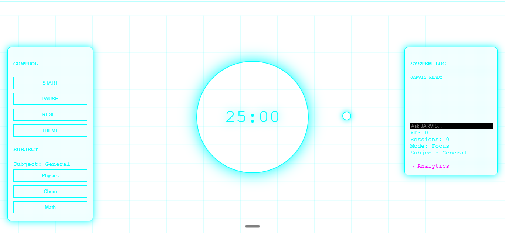
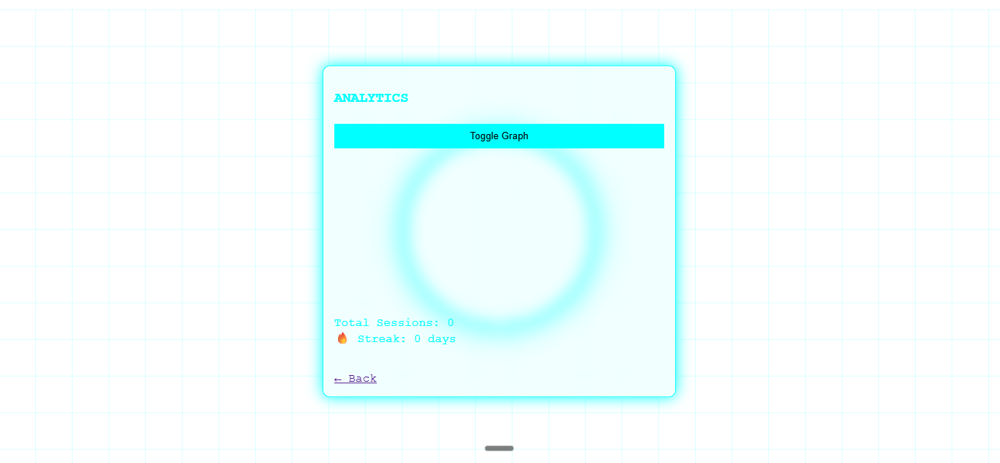

#  JARVIS Pomodoro App

A simple and interactive productivity app based on the **Pomodoro technique**. It helps you stay focused while keeping things clean and easy to use.

---

##  Timer

- A **25-minute timer** placed at the center of the screen  
- Buttons available:
  - Start
  - Pause
  - Reset  
  - Theme  

---

##  Theme

- You can change colors by clicking on **Theme**
- The overall look is inspired by **JARVIS**

---

##  System Log

- Located on the **right side**
- Shows what subject you are currently studying
- Keeps track of your sessions

---

##  Analytics

- Shows how long you studied each subject
- Simple graphs to help you understand your progress

---

##  Screenshots

### Main Screen

### Analytics

---

##  How to Use

1. Choose what you want to study  
2. Press **Start**  
3. Focus for 25 minutes  
4. Take a break  
5. Repeat  

---
